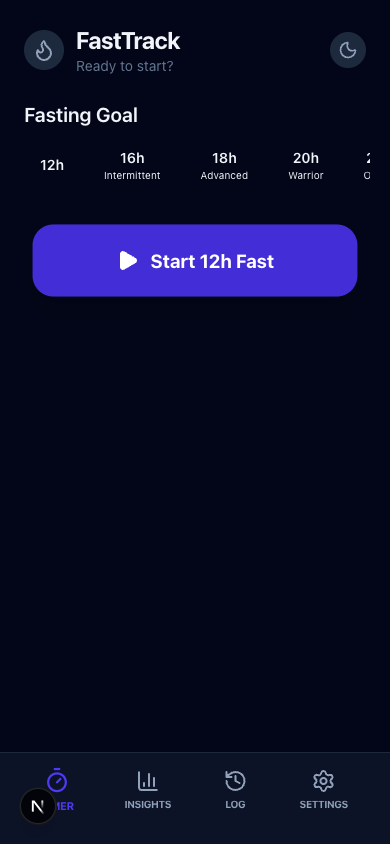
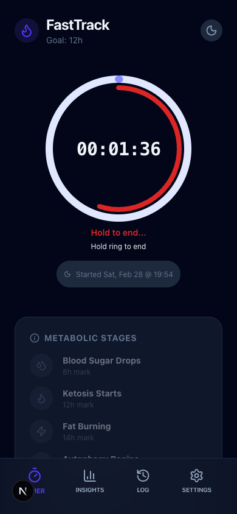
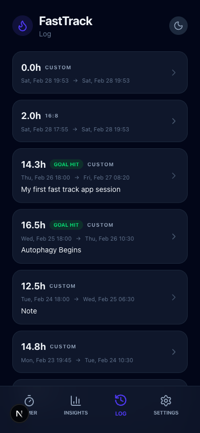
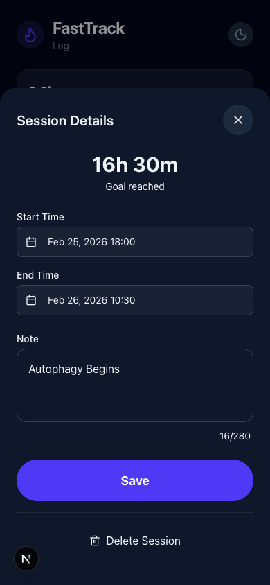
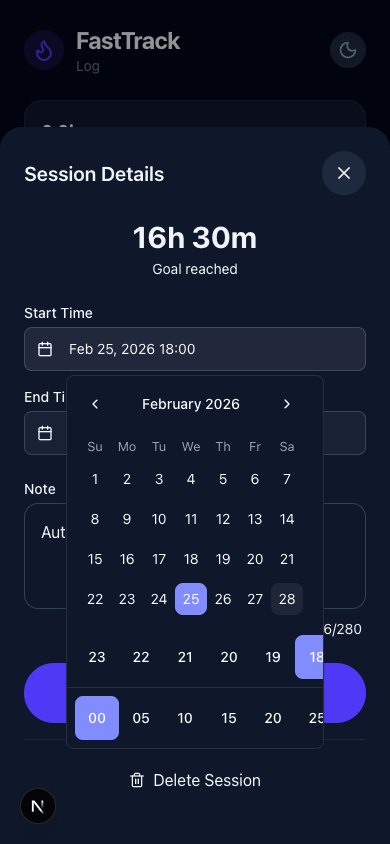
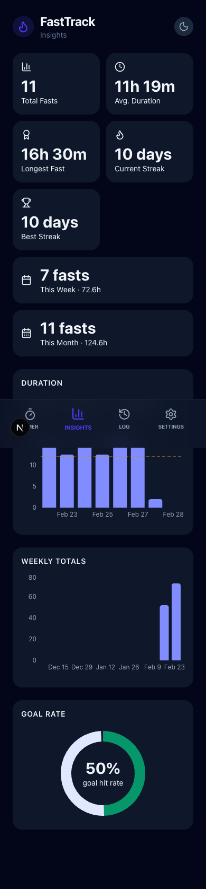
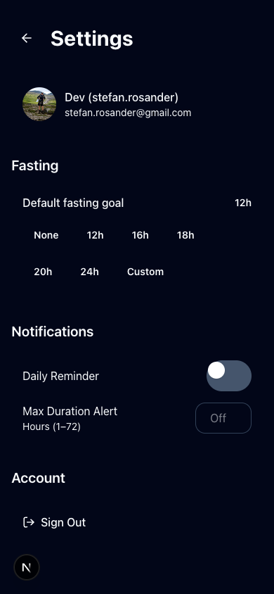

# FastTrack

A mobile-first fasting tracker web app for up to 5 authorized users. Core workflow: start a fast, stop a fast, review history.

Built with Next.js 16 (App Router), deployed on Vercel.

---

## Screenshots

### Timer & Progress Ring

<div align="center">
  
  &nbsp;
  
  &nbsp;
  
</div>

<p align="center"><sub>Goal selection &nbsp;·&nbsp; Active session with progress ring &nbsp;·&nbsp; Long-press confirmation arc</sub></p>

### History & Editing

<div align="center">
  
  &nbsp;
  
  &nbsp;
  
</div>

<p align="center"><sub>Session log &nbsp;·&nbsp; Session edit modal &nbsp;·&nbsp; ShadCN calendar + scroll picker</sub></p>

### Insights & Settings

<div align="center">
  
  &nbsp;
  
</div>

<p align="center"><sub>Insights with stats, duration chart, and goal rate &nbsp;·&nbsp; Settings</sub></p>

---

## Features

- **Start / Stop fasting** — one-tap to begin a fast; long-press the progress ring for 5 seconds to end it (with animated confirmation arc and "Hold to end…" hint)
- **Progress ring** — circular arc shows elapsed time vs. goal; always visible during an active session (uses 16-hour default for goal-less sessions)
- **Session editing** — edit start/end times via a polished ShadCN date-time picker (calendar + scrollable 24 h / 5-min columns in a popover)
- **Session history** — paginated list with duration, goal, and notes
- **Statistics & charts** — streak, average duration, completion rate, trend charts (Recharts)
- **Fasting goal** — preset or custom goal duration, persisted per user
- **User settings** — profile, default goal, notification reminders, appearance (dark/light/system)
- **Notifications** — browser Notification API with in-app toast fallback
- **Multi-user** — up to 5 authorized Google accounts; each user's data is fully isolated

---

## Tech Stack

| Layer | Technology |
|-------|-----------|
| Framework | Next.js 16 (App Router) — server components, API routes, server actions |
| Deployment | Vercel |
| Authentication | Auth.js v5 (next-auth@beta) — Google OAuth, JWT sessions |
| Database | Vercel Postgres (managed PostgreSQL) via Prisma 7 |
| Styling | Tailwind CSS v4 |
| UI Components | ShadCN (Calendar, Popover, Button, ScrollArea) |
| Charts | Recharts |
| Icons | Lucide React |
| Package manager | Bun |

---

## Getting Started

### 1. Environment Variables

Copy the template and fill in your values:

```bash
cp .env.local.example .env.local
```

| Variable | Where to get it |
|----------|----------------|
| `AUTH_SECRET` | `openssl rand -base64 32` |
| `AUTH_GOOGLE_ID` | [Google Cloud Console](https://console.cloud.google.com) → APIs & Services → Credentials → OAuth 2.0 Client ID |
| `AUTH_GOOGLE_SECRET` | Same as above |
| `AUTHORIZED_EMAILS` | Comma-separated list of Google account emails allowed to sign in (up to 5) |
| `fast_track_DATABASE_URL_UNPOOLED` | Vercel Postgres dashboard → your database → `.env.local` tab |

**Google OAuth redirect URIs** — add these in Google Cloud Console under your OAuth client:
- Development: `http://localhost:3000/api/auth/callback/google`
- Production: `https://your-vercel-domain.vercel.app/api/auth/callback/google`

> **Note**: `AUTHORIZED_EMAIL` (singular) is still accepted as a fallback for single-user setups.

### 2. Database

```bash
bunx prisma migrate dev --name init
```

### 3. Run the development server

```bash
bun dev
```

Open [http://localhost:3000](http://localhost:3000) in your browser.

---

## Vercel Deployment

Set these environment variables in **Settings → Environment Variables**:

| Variable | Notes |
|----------|-------|
| `AUTH_SECRET` | Same value as local — do not reuse across projects |
| `AUTH_GOOGLE_ID` | From Google Cloud Console |
| `AUTH_GOOGLE_SECRET` | From Google Cloud Console |
| `AUTHORIZED_EMAILS` | Comma-separated list of authorized Google emails |
| `fast_track_DATABASE_URL_UNPOOLED` | Auto-populated when you link a Vercel Postgres database |

> **Security**: `AUTHORIZED_EMAILS` must **never** be prefixed with `NEXT_PUBLIC_` — server-side only.

---

## Key UI Interactions

### Ending a fast — long-press progress ring
The "End Fast" button has been replaced with a long-press gesture on the progress ring:
1. Press and hold the ring for **5 seconds**.
2. A red confirmation arc fills from 0 → 100 % while "Hold to end…" is displayed.
3. Release early → arc resets, session continues.
4. Hold the full 5 s → session ends automatically.

A persistent "Hold ring to end" hint is always visible below the ring for discoverability. A screen-reader / keyboard-accessible hidden "End session" action is also available as a fallback.

### Session editing — ShadCN date-time picker
Start and end times in the Session Details modal use a unified popover component:
- **Calendar** for date selection
- **Scrollable hour column** (0–23)
- **Scrollable minute column** (00, 05, …, 55)

The trigger displays the value as `Feb 25, 2026 18:00`. All existing validation (end after start, times in the past) still applies.

---

## Project Structure

```
src/
  app/           # Next.js App Router pages and API routes
  components/    # Shared React components
    ui/          # Low-level UI primitives (ShadCN, pickers, etc.)
  lib/           # Auth config, Prisma client, validators, utilities
  app/actions/   # Next.js server actions
prisma/          # Schema and migrations
specs/           # Feature specs, plans, and task lists
plans/           # Epic-level planning documents
docs/            # PRD and reference docs
```

---

## Learn More

- [Next.js Documentation](https://nextjs.org/docs)
- [Auth.js Documentation](https://authjs.dev)
- [Prisma Documentation](https://www.prisma.io/docs)
- [ShadCN UI](https://ui.shadcn.com)
